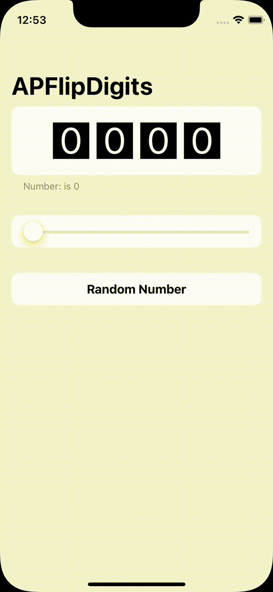
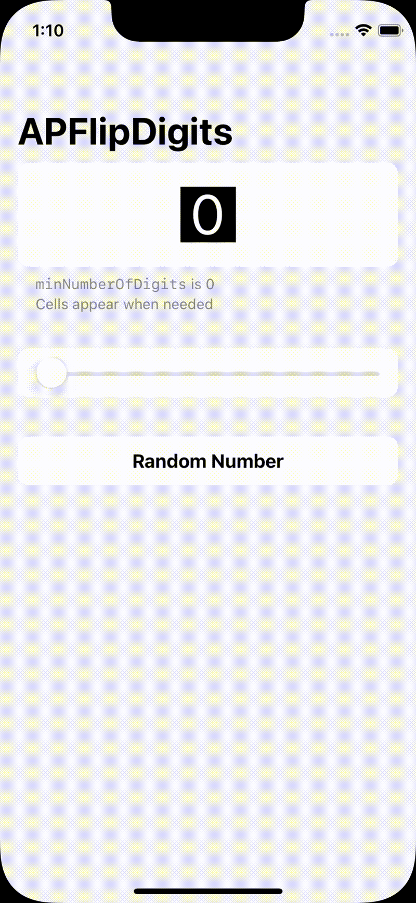
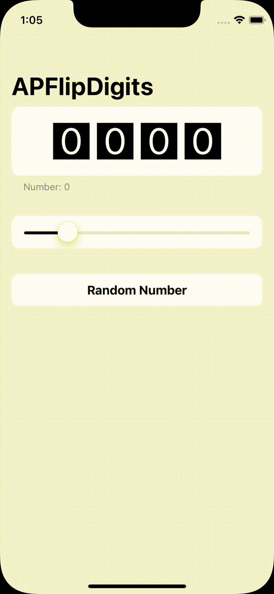

# APFlipDigits


<!-- <picture>
  <source media="(prefers-color-scheme: dark)" srcset="Assets/Presentation-Dark.gif">
  
</picture> -->

<div align="center">

</div>

<br/>

APFlipDigits is a SwiftUI package that lets you create an animated view capable of displaying numbers!


> Inspiration came from [this article](https://medium.com/@martin_8889/flutter-animated-multi-digit-display-1c9e45c99cfc)

## Features

<table>
  <tr>
    <th> Default </th>
    <th> Appearing Cells </th>
    <th> Negative Number </th>
    <th> Customization </th>
  </tr>
  <tr>
    <td>
      
    </td>
    <td>
      
    </td>
    <td>
      
    </td>
    <td>
      
    </td>
  </tr>
</table>

## Usage

Just instantiante a new `FlipDigits` view, specifying the number you want to display and, eventually, the minimum number of digits the view should display

```swift
import APFlipDigits
struct ContentView : View {

  @State private var number : Int = 100
  
  var body : some View {
    FlipDigits(number: $number, minNumberOfDigits: 3)
  }
}
```

You can customize the view specifying a `FlipDigitsOptions`, like in this example here:

```swift
import APFlipDigits
struct ContentView : View {

  @State private var number : Int = 100

  var body : some View {
    FlipDigits(
      number: $number,
      minNumberOfDigits: 3, 
      options:.init(
        cellSize: 70,
        cellSpacing: 0,
        cellColor: .blue,
        foregroundColor: .yellow
      )
    )
  }

}
```

## Installation

### Xcode Project

You have to select `File` -> `Swift Packages` -> `Add Package Dependency` and enter the repository url `https://github.com/antoniopantaleo/APFlipDigits.git`

### Swift Package Manager

You have to add the package as a dependency in your `Package.swift` file
```swift
let package = Package(
    //...
    dependencies: [
        .package(url: "https://github.com/antoniopantaleo/APFlipDigits.git", upToNextMajor(from: "1.0.0")),
    ],
    //...
)
```

## License

[MIT](LICENSE)
