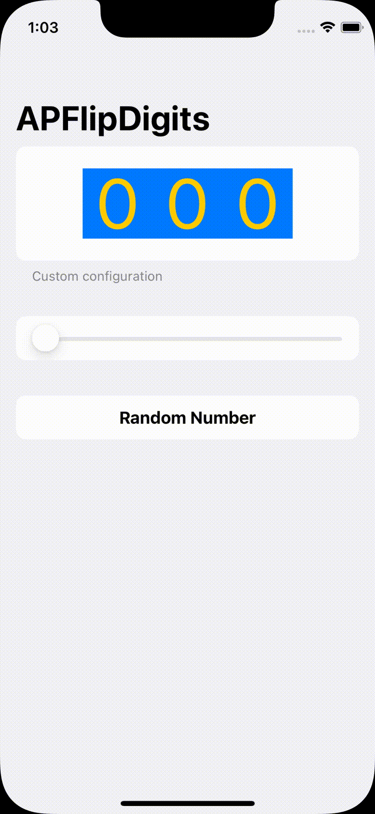

# APFlipDigits


 


<picture>
  <source media="(prefers-color-scheme: dark)" srcset="Assets/Presentation-Dark.gif">
  
</picture>

APFlip digits is a SwiftUI package 

## Features

<table>
  <tr>
    <th> Standard </th>
    <th> Standard </th>
    <th> Standard </th>
    <th> Standard </th>
  </tr>
  <tr>
    <td>
      
    </td>
    <td>
      
    </td>
    <td>
      
    </td>
    <td>
      
    </td>
  </tr>
</table>

## Usage

```swift
import APFlipDigits

struct ContentView : View {

  @State private var number : Int = 100

  var body : some View {
    FlipDigits(number: $number, minNumberOfDigits: 3)
  }

}
```

```swift
import APFlipDigits

struct ContentView : View {

  @State private var number : Int = 100

  var body : some View {
    FlipDigits(
      number: $number,
      minNumberOfDigits: 3, 
      options:.init(
        cellSize: 70,
        cellSpacing: 0,
        cellColor: .blue,
        foregroundColor: .yellow
      )
    )
  }

}
```

## Installation

## License